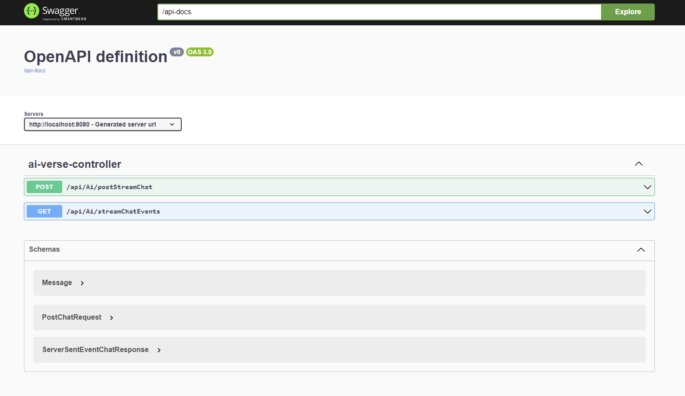

# AI Verse API (Java Edition)

The API for [AI Verse connecting with Java API](https://github.com/robertmok/ai-verse/tree/feature/with-java-api). It uses **Spring Boot REST API** and **server-side-events** stream for real time data.

## Setup

### Prerequisites

- Install [Ollama](https://ollama.com/)
- Download [gemma:2b](https://ollama.com/library/gemma)
- Download [orca-mini:3b](https://ollama.com/library/orca-mini)

### Quickstart

- Have **Ollama** running
	- Ollama REST API runs on http://localhost:11434
- Run the application
	- Swagger will be running on http://localhost:8080/swagger-ui/index.html
    -  `POST postStreamChat` endpoint is for sending the request.
    -  `GET streamChatEvents` endpoint returns the **server-side-events** stream to be subscribed by the frontend.
- Follow the **Setup** section in [AI Verse connecting with Java API](https://github.com/robertmok/ai-verse/tree/feature/with-java-api)

## Limitations

- no cancellation when it is generating response.

## Checkout the other **AI Verse** repos:

[AI Verse connecting with ASP.NET Core API](https://github.com/robertmok/ai-verse)

[AI Verse API (ASP.NET Core)](https://github.com/robertmok/ai-verse-api)
